# 🚇 SMRT MCP PoC

> **Proof of Concept (PoC)** implementation of the **Model Context Protocol (MCP)** using **Rust**,  
> applied in an **IT Operations** scenario for the **Singapore Mass Rapid Transportation (SMRT)** system.  

⚠️ **Disclaimer**  
This project is for **demonstration & educational purposes only**.  
I am **not affiliated** with the IT Department of SMRT.  

---

## 🧩 What is MCP?

**Model Context Protocol (MCP)** is a standard for connecting AI assistants to external tools, data sources, and APIs.  

Instead of hardcoding application logic or asking users to memorize commands, MCP enables an **AI-driven intent router** that:  

1. Accepts **natural language** queries from users.  
2. Uses an **AI model** (OpenAI Responses API with JSON Schema) to **detect the intent**.  
3. Maps the intent to **one or more API endpoints**.  
4. Fetches and optionally **joins data** from those endpoints.  
5. Returns results to the AI for **human-readable answers** in the chat interface.  

💡 **Example:**  
User: *“Did the last GitLab CI job for the main branch succeed or fail?”*  
- MCP Router detects intent = `ci_status`.  
- Routes to `/api/gitlab-ci`.  
- Fetches dummy JSON with job status + failed tests.  
- AI composes a clear answer for the user.  

👉 With MCP, developers don’t have to build custom logic for each question. Instead, **MCP bridges user intent ↔ system APIs** in a structured, scalable way.

---

## 🔧 Tech Stack

- 🦀 **Backend**: Rust (Axum, SQLx, Reqwest, SSE)  
- ⚡ **Frontend**: Vue 3 + Vite + TypeScript  
- 🗄️ **Database**: MySQL 8  
- 🐳 **Infrastructure**: Docker & Docker Compose  
- 🤖 **AI**: OpenAI GPT (Responses API + JSON Schema)  

---


## 🔄 Sequence Flow (Mermaid)

```mermaid

sequenceDiagram
    autonumber
    participant U as User
    participant F as ChatPanel (Vue 3)
    participant B as Backend (Rust/Axum)
    participant R as MCP Router
    participant O as OpenAI (Intent)
    participant E as API Endpoints (dummy)
    participant DB as MySQL

    U->>F: Ask question (natural language)
    F->>B: POST /api/chat (or /api/chat/stream)
    B->>R: Hand off to MCP Router
    R->>O: Intent detection (Responses API + JSON Schema)
    O-->>R: Intent + routing plan (e.g., ci_status → /api/gitlab-ci)
    R->>E: Fetch data from mapped endpoint(s)
    E-->>R: JSON payload(s)
    R->>DB: (Optional) persist/query cached results
    DB-->>R: Data rows (if any)
    R-->>B: Joined + normalized result
    B-->>F: SSE stream (received → llm_start → route_planned → fetch_progress → joined → done)
    F-->>U: Render human-readable answer
````




```




## 🏗 Architecture Overview

### Components
- **Frontend (Vue 3 + Vite + TS)** — ChatPanel UI, SSE streaming, status chips (intent/endpoint/phases).
- **Backend (Rust/Axum)** — HTTP API, SSE handler, tracing, error handling.
- **MCP Router (Rust module)** — Prompt Builder → Intent Classifier → Endpoint Planner → Normalizer/Joiner.
- **AI (OpenAI GPT)** — Intent detection with JSON Schema output.
- **Data Sources (Dummy Endpoints)** — `/api/gitlab-ci`, `/api/runtime-logs`, `/api/observability`, `/api/security-auth`, `/api/incident-metrics`, etc.
- **Database (MySQL 8)** — Config & optional cache (`api_results`), future auth (`users`, `sessions`).
- **Infra (Docker & Compose)** — Reproducible local stack.

### High-Level Data Flow
1. User asks in ChatPanel → `POST /api/chat` (or `/api/chat/stream` for SSE).  
2. Backend forwards to **MCP Router**.  
3. MCP calls **OpenAI** (Responses API + JSON Schema) to get intent & routing plan.  
4. MCP fetches from mapped endpoint(s), optionally consults **MySQL**.  
5. MCP normalizes/joins → Backend streams via **SSE** → UI renders phases & final answer.

### Architecture Diagram (Mermaid)
```mermaid
flowchart TD
    subgraph Client
      U[User] --> F[ChatPanel (Vue 3 + Vite)]
    end

    subgraph Server[Rust Backend (Axum)]
      F -->|HTTP/SSE| B[API Gateway & SSE Handler]
      B --> R[MCP Router<br/>(Prompt Builder • Intent Classifier • Joiner)]
      R -->|JSON Schema| O[OpenAI Responses API]
      R --> E1[/api/gitlab-ci/]
      R --> E2[/api/runtime-logs/]
      R --> E3[/api/observability/]
      R --> E4[/api/security-auth/]
      R --> E5[/api/incident-metrics/]
      R <-- DB[(MySQL 8)]
      B --> DB
    end

    O -.-> R
    E1 -. JSON .-> R
    E2 -. JSON .-> R
    E3 -. JSON .-> R
    E4 -. JSON .-> R
    E5 -. JSON .-> R

    R -->|Normalized Result| B
    B -->|SSE Stream| F
    F --> U

### Components
- **Frontend (Vue 3 + Vite + TS)**  
  ChatPanel UI, streams SSE, renders status chips (intent, endpoint, phases).
- **Backend (Rust/Axum)**  
  HTTP API, SSE streaming, error handling, request tracing.
- **MCP Router (Rust module)**  
  - Prompt builder → OpenAI Responses API (JSON Schema)  
  - Intent classifier → endpoint planner (single/multi-endpoint join)  
  - Normalizer/Joiner → consistent response shape for UI
- **AI (OpenAI GPT)**  
  Intent detection & structured output (schema-validated).
- **Data Sources (Dummy Endpoints)**  
  `/api/gitlab-ci`, `/api/runtime-logs`, `/api/observability`, `/api/security-auth`, `/api/incident-metrics`, etc.
- **Database (MySQL 8)**  
  App config, seeds; optional caching table (`api_results`) and auth tables (`users`, `sessions`).
- **Infra (Docker & Compose)**  
  Reproducible builds for backend, frontend, and MySQL.

### High-Level Data Flow
1. User asks a question in ChatPanel → `POST /api/chat` (or `…/stream` for SSE).
2. Backend passes the request to **MCP Router**.
3. Router calls **OpenAI** to classify intent & produce a routing plan (JSON Schema).
4. Router queries one or more **dummy endpoints**, optionally consults **MySQL** (cache/config).
5. Router **joins & normalizes** results → Backend **streams** them to the UI via **SSE**.
6. Frontend renders incremental phases and the final human-readable answer.

### Non-Goals (for this PoC)
- Real integrations (Grafana, Prometheus, GitLab API) — replaced with dummy endpoints.
- Multi-tenant auth (JWT scaffolding listed under “Next Steps”).
- Production-grade observability/security (kept minimal for clarity).

---

### Architecture Diagram (Mermaid)

```mermaid
flowchart TD
    subgraph Client
      U[User] --> F[ChatPanel (Vue 3 + Vite)]
    end

    subgraph Server[Rust Backend (Axum)]
      F -->|HTTP/SSE| B[API Gateway & SSE Handler]
      B --> R[MCP Router<br/>(Prompt Builder • Intent Classifier • Joiner)]
      R -->|JSON Schema| O[OpenAI Responses API]
      R --> E1[/api/gitlab-ci/]
      R --> E2[/api/runtime-logs/]
      R --> E3[/api/observability/]
      R --> E4[/api/security-auth/]
      R --> E5[/api/incident-metrics/]
      R <-- DB[(MySQL 8)]
      B --> DB
    end

    O -.-> R
    E1 -. JSON .-> R
    E2 -. JSON .-> R
    E3 -. JSON .-> R
    E4 -. JSON .-> R
    E5 -. JSON .-> R

    R -->|Normalized Result| B
    B -->|SSE Stream| F
    F --> U
````

### Suggested Tables (optional, PoC-friendly)

* `settings` — key/value app configuration.
* `api_results` — simple cache: `endpoint`, `params_hash`, `payload`, `created_at`.
* `users` / `sessions` — for future JWT-based auth.

### Extension Ideas

* Plug **Grafana/Prometheus** for real metrics.
* Add **rate limits** & **circuit breakers** per endpoint.
* Persist **audit logs** for prompt, intent, and endpoint calls.
* Expose **/internal/debug** for tracing intent & routing decisions.

---

